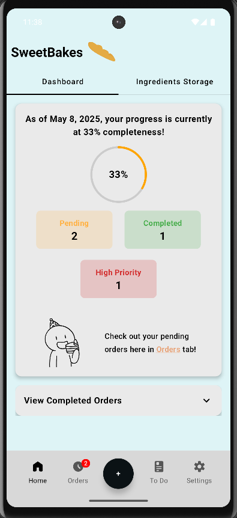
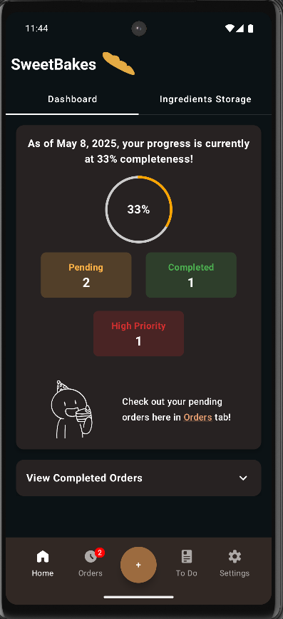
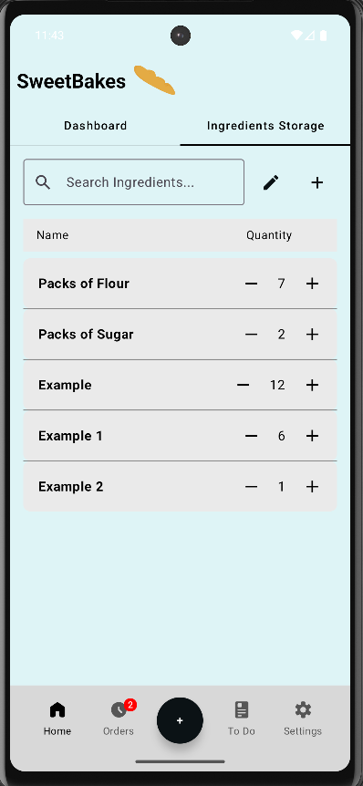
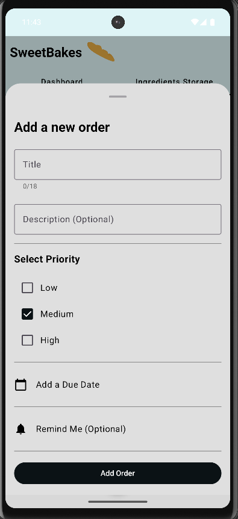
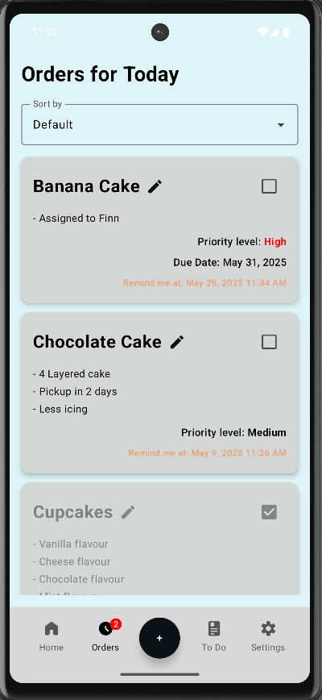
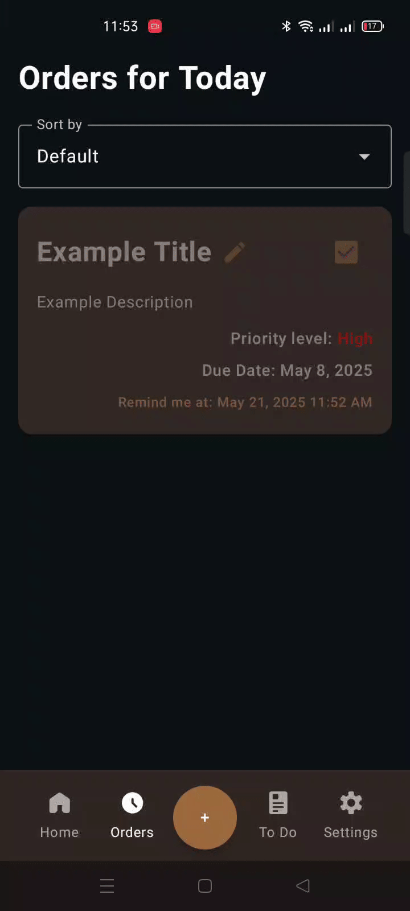
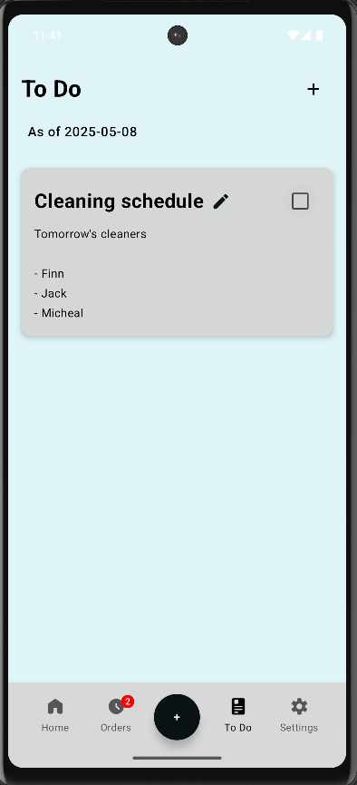
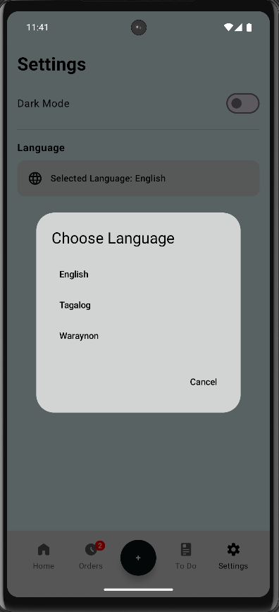

# SweetBakes - Multi-Feature To-Do list Android App!

A native Android app built with Kotlin and Jetpack Compose created by Art Lyndone Hemplo.

## Features
- Home Dashboard
- Storage section where you can view your storage ingredients and more
- Room Database for storing data
- Easy Navigation/Good user experience
- Light/Dark mode
- Language selection
- Bottom Sheet to create order
- Swipe to delete items
- View Orders with sorting, check if finished, and Edit a certain item

## Home Dashboard + Featuring Light and Dark mode

## Storage feature

## Create Order bottom sheet

## Orders Tab

## Swipe to Delete for easy user experience

## To Do list Tab

## Language selection

